[instagram](https://www.instagram.com/ft.avadhut_/) &nbsp;·&nbsp;
[linkedin](https://www.linkedin.com/in/avadhut-satpute-187044306/) &nbsp;·&nbsp;
[email](mailto:avadhutsatpute2006@gmail.com)

> AIML student at KITCOEK. 
> Passionate about Python, Web Development, Backend systems, and UI/UX.

I am an aspiring software developer eager to build and test ideas. Right now, I am focusing on building interactive web experiences, seamless backend systems, and honing my Python skills. 
Check out some of my recent work below!

<samp>python &nbsp; react &nbsp; html &nbsp; css &nbsp; ui/ux &nbsp; backend &nbsp; supabase &nbsp; ai &nbsp; iot &nbsp; git</samp>

**[AwakeGuard](https://github.com/Avadhut2/AwakeGuard)** &nbsp;·&nbsp; <samp>iot, esp32-cam, ai, supabase</samp> 
A smart IoT-based Driver Drowsiness Detection System built using ESP32-CAM, AI, and Supabase, 
capable of image capture, and Telegram alerts with an integrated cloud dashboard.

